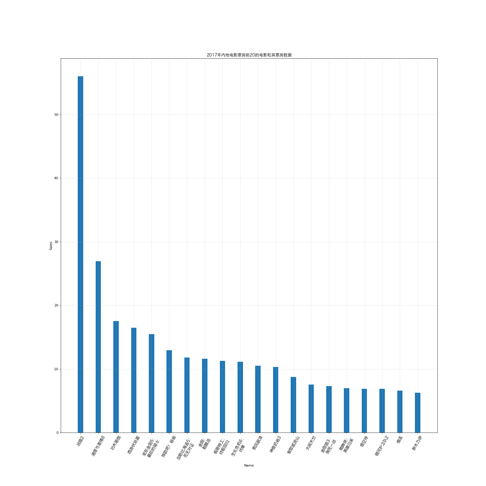
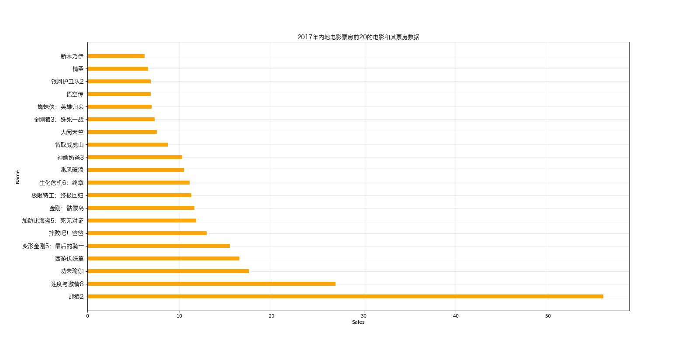
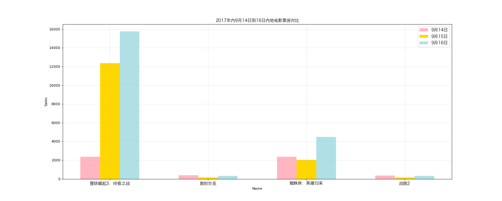

# Matplotlib - Bar Chat 

## Import Modules
```python
import pyplot
import matplotlib.pyplot as plt
import random
import matplotlib
from matplotlib import font_manager 
```

## Define Font for Chinese Charaters 
- For macOS

```python
my_font = font_manager.FontProperties(size = 12, fname = "/System/Library/Fonts/Hiragino Sans GB.ttc")
```
## Case One
### Background
- 假设现在有2017年内地电影票房前20的电影(列表a)和电影票房数据(列表b)

```python
a = 
["战狼2","速度与激情8","功夫瑜伽","西游伏妖篇","变形金刚5：最后的骑士","摔跤吧！爸爸",
     "加勒比海盗5：死无对证","金刚：骷髅岛","极限特工：终极回归","生化危机6：终章","乘风破浪","神偷奶爸3",
     "智取威虎山","大闹天竺","金刚狼3：殊死一战","蜘蛛侠：英雄归来","悟空传","银河护卫队2","情圣","新木乃伊"]
```
```python
b = [56.01,26.94,17.53,16.49,15.45,12.96,11.8,11.61,11.28,11.12,10.49,10.3,8.75,
   7.55,7.32,6.99,6.88,6.86,6.58,6.23]
```
- *电影票房数据的单位：亿* 

#### Modify dataset
- 用 ```\n``` 来换行

```python
a = 
["战狼2","速度与激情8","功夫瑜伽","西游伏妖篇","变形金刚5：\n最后的骑士","摔跤吧！爸爸",
     "加勒比海盗5：\n死无对证","金刚：\n骷髅岛","极限特工：\n终极回归","生化危机6：\n终章","乘风破浪","神偷奶爸3",
     "智取威虎山","大闹天竺","金刚狼3：\n殊死一战","蜘蛛侠：\n英雄归来","悟空传","银河护卫队2","情圣","新木乃伊"]
```

### Question
- 如何更加直观的展示该数据？

### Solution
- Categorical data --> using bar chat

```python
# Step 1: set the figure size 
plt.figure(figsize = (20, 20), dpi = 80)

# Step 2: determine number of movies in the dataset a --> equals to the number of bars
x = range(len(a)) 
print(x)

# Step 3: draw the bar chat 
plt.bar(x, b, width = 0.3)

# Step 4: set the x-axis
plt.xticks(x, a, font_properties = my_font, rotation = 60)

# Step 5: add description
plt.xlabel("Name")
plt.ylabel("Sales")
plt.title("2017年内地电影票房前20的电影和其票房数据", fontproperties = my_font)
plt.grid(alpha = 0.3)

# Step 6: save and display figure
plt.savefig("./matplotlib/film_1")
plt.show()
```



### Alternative Solution
- Draw a horizontal bar chat 

```python
# Step 1: set the figure size 
plt.figure(figsize = (20, 10), dpi = 80)

# Step 2: determine number of movies in the dataset a --> equals to the number of bars
x = range(len(a)) 
print(x)

# Step 3: draw the horizontal bar chat 
plt.barh(x, b, height = 0.3, color = "orange")

# Step 4: set the x-axis
plt.yticks(x, a, font_properties = my_font)

# Step 5: add description
plt.xlabel("Sales")
plt.ylabel("Name")
plt.title("2017年内地电影票房前20的电影和其票房数据", fontproperties = my_font)
plt.grid(alpha = 0.3)

# Step 6: save and display figure
plt.savefig("./matplotlib/film_2")
plt.show()
```



## Case Two
### Background 
- 四部电影分别在2017-09-14到2017-09-16三天的票房

```python
a = ["猩球崛起3：终极之战","敦刻尔克","蜘蛛侠：英雄归来","战狼2"]
```
```python
b_16 = [15746,312,4497,319]
b_15 = [12357,156,2045,168]
b_14 = [2358,399,2358,362]
```

### Question
- 请展现每部电影的票房，同时与其他几部电影的数据进行对比

### Solution
```python
# Step 1: set the figure size 
plt.figure(figsize = (20, 8), dpi = 80)

# Step 2: determine number of movies in the dataset a
# --> equals to number of bars needed for 9月14日
x_14 = list(range(len(a)))

# Step 3: to avoid the overlapping of each bar
bar_width = 0.2
x_15 = [i + bar_width for i in x_14]
x_16 = [i + bar_width * 2 for i in x_14]

# Step 3: plot mutiple bar chats 
plt.bar(x_14, b_14, width = bar_width, color = "#FFB6C1", label = "9月14日")
plt.bar(x_15, b_15, width = bar_width, color = "#FFD700", label = "9月15日")
plt.bar(x_16, b_16, width = bar_width, color = "#B0E0E6", label = "9月16日")

# Step 4: set the x-axis (只需要居中对齐即可)
plt.xticks(x_15, a, font_properties = my_font)

# Step 5: add description
plt.xlabel("Name")
plt.ylabel("Sales")
plt.title("2017年内9月14日到16日内地电影票房对比", fontproperties = my_font)
plt.legend(loc = "best", prop = my_font)
plt.grid(alpha = 0.3)

# Step 6: save and display figure
plt.savefig("./matplotlib/film_3")
plt.show()
```



