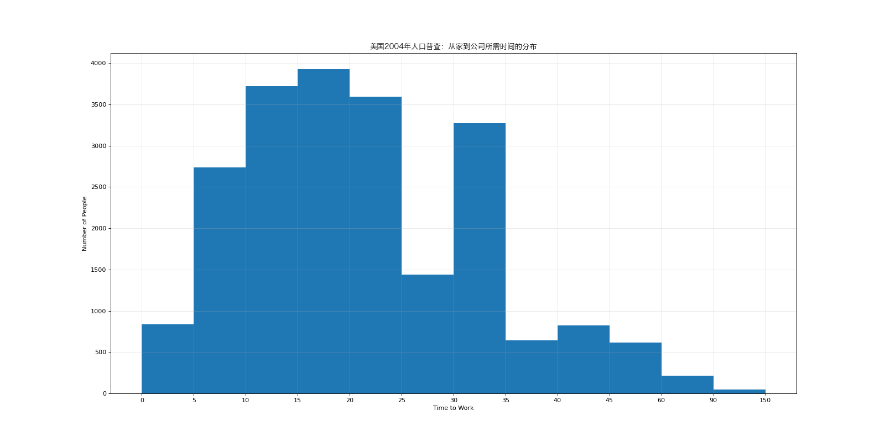

# Histogram

## Import Modules
```python
import matplotlib.pyplot as plt
import random
import matplotlib
from matplotlib import font_manager 
```

## Define Font for Chinese Charaters 
- For macOS
```python
my_font = font_manager.FontProperties(size = 12, fname = "/System/Library/Fonts/Hiragino Sans GB.ttc")
```
## Case One
### Background
- 现有250部电影的时长(列表a)

```python
a = 
[131,  98, 125, 131, 124, 139, 131, 117, 128, 108, 135, 138, 131, 102, 107, 114, 119, 128, 
   121, 142, 127, 130, 124, 101, 110, 116, 117, 110, 128, 128, 115,  99, 136, 126, 134,  95, 
   138, 117, 111,78, 132, 124, 113, 150, 110, 117,  86,  95, 144, 105, 126, 130,126, 130, 126, 
   116, 123, 106, 112, 138, 123,  86, 101,  99, 136,123, 117, 119, 105, 137, 123, 128, 125, 104, 
   109, 134, 125, 127,105, 120, 107, 129, 116, 108, 132, 103, 136, 118, 102, 120, 114,105, 115, 
   132, 145, 119, 121, 112, 139, 125, 138, 109, 132, 134,156, 106, 117, 127, 144, 139, 139, 119, 
   140,  83, 110, 102,123,107, 143, 115, 136, 118, 139, 123, 112, 118, 125, 109, 119, 133,112, 114, 
   122, 109, 106, 123, 116, 131, 127, 115, 118, 112, 135,115, 146, 137, 116, 103, 144,  83, 123, 111, 
   110, 111, 100, 154,136, 100, 118, 119, 133, 134, 106, 129, 126, 110, 111, 109, 141,120, 117, 106, 
   149, 122, 122, 110, 118, 127, 121, 114, 125, 126,114, 140, 103, 130, 141, 117, 106, 114, 121, 114, 
   133, 137,  92,121, 112, 146,  97, 137, 105,  98, 117, 112,  81,  97, 139, 113,134, 106, 144, 110, 
   137, 137, 111, 104, 117, 100, 111, 101, 110,105, 129, 137, 112, 120, 113, 133, 112,  83,  94, 146, 
   133, 101,131, 116, 111,  84, 137, 115, 122, 106, 144, 109, 123, 116, 111,111, 133, 150]
```

### Question
- 希望统计出这些电影时长的分布状态(比如时长为100分钟到120分钟电影的数量、出现的频率)等信息

### Solution
- Numerical data --> using histogram

```python
# Step 1: set the figure size 
plt.figure(figsize = (20, 10), dpi = 80)

# Step 2: Calculate the number of bins needed for x-axis
# us // for integer divison 
bin_width = 3 # based on mutiple trials (plot and adjust)
num_bins = (max(a) - min(a))//bin_width 

# Step 3: draw the bar chat 
# add density = Ture --> turning the y-axis into percentage instead of absolute counts
plt.hist(a, num_bins, density = True, color = "orange")

# Step 4: set the x-axis
plt.xticks(range(min(a), max(a) + bin_width, bin_width))

# Step 5: add description
plt.xlabel("Length of Film")
plt.ylabel("Frequency")
plt.title("250部电影的时长分布图", fontproperties = my_font)
plt.grid(alpha = 0.3)

# Step 6: save and display figure
plt.savefig("./matplotlib/film_4.png")
plt.show()
```


## Case Two
### Background 
- 美国2004年人口普查发现有124 million的人在离家相对较远的地方工作。根据他们从家到上班地点所需要的时间,通过抽样统计(最后一列)出了下表的数据
```python
interval = [0,5,10,15,20,25,30,35,40,45,60,90]
int_width = [5,5,5,5,5,5,5,5,5,15,30,60]
quantity = [836,2737,3723,3926,3596,1438,3273,642,824,613,215,47]
```
- *不能使用plt.hist.因为plt.hist需要raw data*

### Question
- 请展示美国2004年人口普查中从家到公司所需时间的分布

### Solution
- 绘制条形图，并让每条bar都并在一起，达到histogram的效果 
- *bar chat has a default width of 0.8*
```python
x = interval 
y = quantity 

# Step 1: Set the figure size
plt.figure(figsize = (20, 10), dpi = 80)

# Step 2: check the dimension of each dataset --> make sure they are matched
# for range(x), x must be integer not a list
print(len(interval), len(int_width), len(quantity))

# Step 3: plot the bar chat
# since there are 12 items in each dataset, so use range(12) for convenience 
plt.bar(range(12), y, width = 1)

# Step 4: set the x-axis (对应真正的interval刻度)
_x = [i - 0.5 for i in range(len(x)+1)]
_xtick_labels = x + [150]
plt.xticks(_x, _xtick_labels)

# Step 5: add description
plt.xlabel("Time to Work")
plt.ylabel("Number of People")
plt.title("美国2004年人口普查：从家到公司所需时间的分布", fontproperties = my_font)
plt.grid(alpha = 0.3)

# Step 6: save and display figure
plt.savefig("./matplotlib/distance.png")
plt.show()
```



