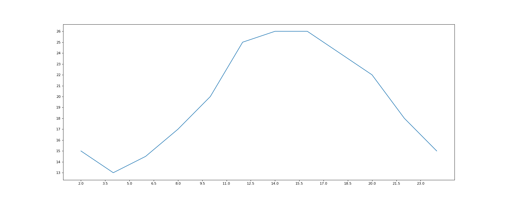
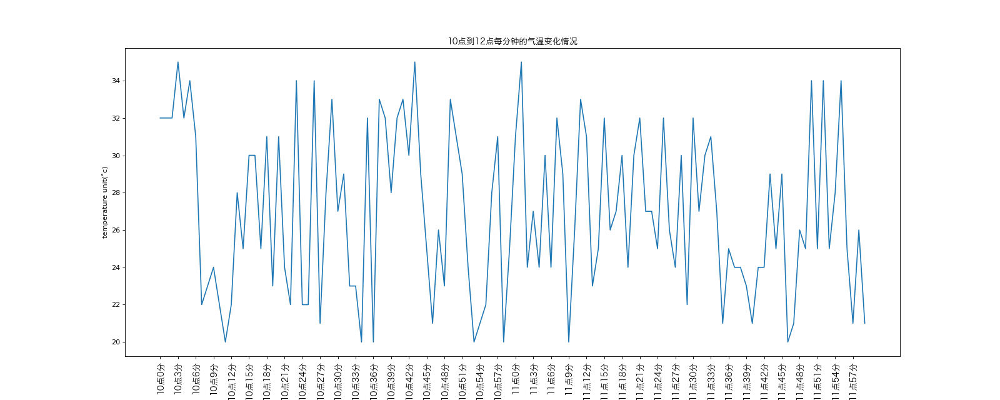
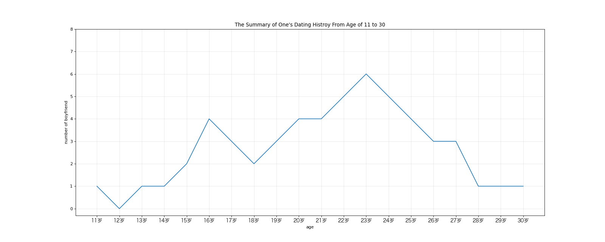
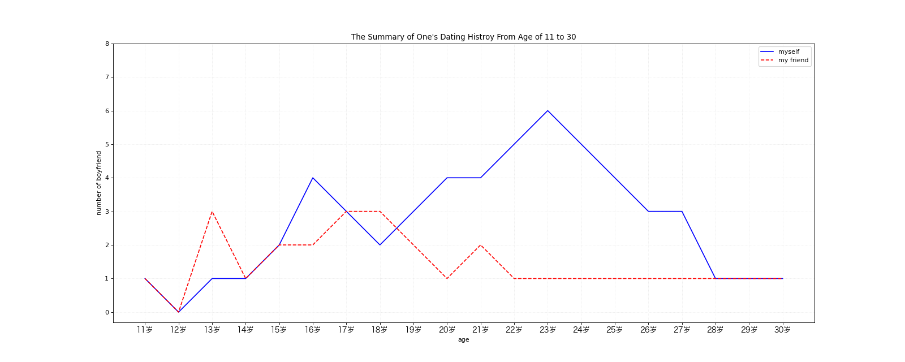

# Matplotlib - Line Chat 

## Import Modules
```python
import matplotlib.pyplot as plt
import random
import matplotlib
from matplotlib import font_manager 
```

## Define Font for Chinese Charaters 
- For macOS  

```python
my_font = font_manager.FontProperties(size = 12, fname = "/System/Library/Fonts/Hiragino Sans GB.ttc")
```

## Demo
### Background
```python
x = range(2, 26, 2)
```
```python
y = [15, 13, 14.5, 17, 20, 25, 26, 26, 24, 22, 18, 15]
```

### Solution
```python
# set the size of graph
plt.figure(figsize = (20, 8), dpi = 80) #width, hight

# plot the graph 
plt.plot(x, y)

# plot x and y axis with specific spacing（区间）
plt.xticks(range(2, 25))

# with half-size spacing
xtick_lables = [i/2 for i in range (4, 49)]

# only showcase every-three marks
plt.xticks(xtick_lables[::3])

# for y-axis spacing
plt.yticks(range(min(y), max(y)+1))

#save the graph 
plt.savefig("./matplotlib/graph.png")

# display the graph 
plt.show()
```



## Case One
### Background
- 10点到12点每分钟的气温变化情况如下:

```python
x = range(0, 120)
```
```python
y = [random.randint(20, 35) for i in range(120)]
```

### Question
- 请展示10点到12点每分钟的气温变化情况

### Solution
- Since we are looking for trend and the data is numercial, we are going to use line chat

```python
# Step 1: set the figure size 
plt.figure(figsize = (20, 8), dpi = 80)

# Step 2: plot the temperature for every minutes between 10 to 12 pm
plt.plot(x, y)

# Step 3: set the x-axis (表示为时间)
_x = list(x)
xtick_lables = ["10点{}分".format(i) for i in range(60)]
xtick_lables += ["11点{}分".format(i) for i in range(60)]

# align spacing, rotate the x-axis lables to certain degree, 使matplotlib显示中文
plt.xticks(_x[::3], xtick_lables[::3], rotation = 90, fontproperties = my_font)

# Step 4: add description
plt.xlabel("time")
plt.ylabel("temperature unit(˚c)")
plt.title("10点到12点每分钟的气温变化情况", fontproperties = my_font)

# Step 5: save and display figure
plt.savefig("./matplotlib/temp.png")
plt.show()
```



## Case Two
### Background 
- 假设某人11岁到30岁的交往记录如下:

```python
x = range(11, 31)
```
```python
y = [1, 0, 1, 1, 2, 4, 3, 2, 3, 4, 4, 5, 6, 5, 4, 3, 3, 1, 1, 1]
```

### Question
- 请使用图表展现此人11岁到30岁的交往记录

### Solution
```python
# Step 1: set the figure size 
plt.figure(figsize = (20, 8), dpi = 80)

# Step 2: plot the figure 
plt.plot(x, y)

# Step 3: set the x-axis
xtick_lables = ["{}岁".format(i) for i in x]
plt.xticks(x, xtick_lables, fontproperties = my_font)
plt.yticks(range(0, 9))

# Step 4: add description
plt.xlabel("age")
plt.ylabel("number of boyfriend")
plt.title("The Summary of One's Dating Histroy From Age of 11 to 30")

# to change the transparency of the grid
plt.grid(alpha = 0.3)

# Step 5: save and display figure
plt.savefig("./matplotlib/bf.png")
plt.show()
```



## Case Three
### Background 
- 假设某人和其朋友11岁到30岁的交往记录如下:

```python
x = range(11, 31)
```
```python
y = [1, 0, 1, 1, 2, 4, 3, 2, 3, 4, 4, 5, 6, 5, 4, 3, 3, 1, 1, 1]
```
```python
z = [1, 0, 3, 1, 2, 2, 3, 3, 2, 1, 2, 1, 1, 1, 1, 1, 1, 1, 1, 1]
```

### Question
- 请使用图表展现此人和其朋友11岁到30岁的交往记录

### Solution
```python
# Step 1: set the figure size 
plt.figure(figsize = (20, 8), dpi = 80)

# Step 2: plot the figure 
# 颜色可以直接搜十六进制颜色代码
plt.plot(x, y, label = "myself", color = "blue")
plt.plot(x, z, label = "my friend", color = "red", linestyle = "--")

# Step 3: set the x-axis
xtick_lables = ["{}岁".format(i) for i in x]
plt.xticks(x, xtick_lables, fontproperties = my_font)
plt.yticks(range(0, 9))

# Step 4: add description
plt.xlabel("age")
plt.ylabel("number of boyfriend")
plt.title("The Summary of One's Dating Histroy From Age of 11 to 30")
plt.grid(alpha = 0.3, linestyle = ":")

# 绘制图例 and specify location
# 0 = find the best loation automatically （看源码查位置的代码）
plt.legend(loc = 0) 

# Step 5: save and display figure
plt.savefig("./matplotlib/bf_2.png")
plt.show()
```

- *When hoping to use Chinese charaters in legend --> `plt.legend(prop = my_font)`*




