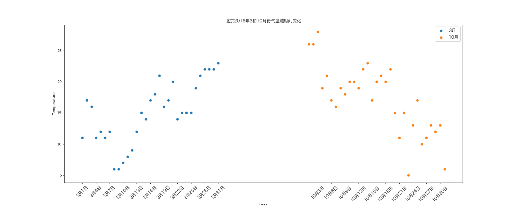

# Matplotlib - Scatter Plot

## Import Modules
```python
import matplotlib.pyplot as plt
import random
import matplotlib
from matplotlib import font_manager 
```

## Define Font for Chinese Charaters 
- For macOS

```python
my_font = font_manager.FontProperties(size = 12, fname = "/System/Library/Fonts/Hiragino Sans GB.ttc")
```
## Case One
### Background
- 北京2016年3和10月份每天白天的最高气温（分别位于如下列表）

```python
x_3 = range(1, 32)

x_10 = range(51,82)
```
```python
y_3 = [11,17,16,11,12,11,12,6,6,7,8,9,12,15,14,17,18,21,16,17,20,14,15,15,15,19,21,22,22,22,23]

y_10 = [26,26,28,19,21,17,16,19,18,20,20,19,22,23,17,20,21,20,22,15,11,15,5,13,17,10,11,13,12,13,6]
```

### Question
- 寻找气温随时间（天）变化的某种规律

### Solution
- Since we are looking for the correlation bettween temperature and time, we are going to use scatter plot

```python
# Step 1: set the figure size 
plt.figure(figsize = (20, 8), dpi = 80)

# Step 2: plot x aginst y for March and October
plt.scatter(x_3, y_3, label = "3月")
plt.scatter(x_10, y_10, label = "10月")

# Step 3: set the x-axis
_x = list(x_3) + list(x_10)
_xtick_lables = ["3月{}日".format(i) for i in x_3]
_xtick_lables += ["10月{}日".format(i - 50) for i in x_10]
plt.xticks(_x[::3], _xtick_lables[::3], fontproperties = my_font, rotation = 45)

# Step 4: add description
plt.xlabel("Date")
plt.ylabel("Temperature")
plt.title("北京2016年3和10月份气温随时间变化", fontproperties = my_font)
plt.legend(loc = "best", prop = my_font)

# Step 5: save and display figure
plt.savefig("./matplotlib/weather.png")
plt.show()
```

