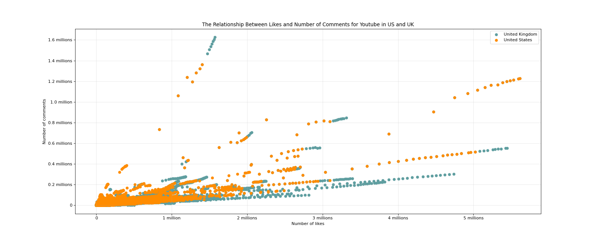

# Numpy - Join and divide Array

## Import Modules
```python
import numpy as np

# import the self-defined function for formating x and y-axis from another python file named "test2_xy_formatter"
from test2_xy_formatter import x_millions_formatter 
from test2_xy_formatter import y_millions_formatter

import matplotlib.pyplot as plt
import matplotlib
import matplotlib.ticker as ticker  
```

## Define Font for Chinese Charaters 
- For macOS

```python
my_font = font_manager.FontProperties(size = 12, fname = "/System/Library/Fonts/Hiragino Sans GB.ttc")
```

## Data Source
- Create two arrays with same shape

```python
t1 = np.arange(12).reshape(2, 6)

t2 = np.arange(12,24).reshape(2, 6)
```
```python
# read in CSV file 
us_file_path = "./data/us_videos.csv"
uk_file_path = "./data/gb_videos.csv"

us = np.loadtxt(us_file_path, delimiter = ",", dtype = "int", skiprows = 1)
uk = np.loadtxt(uk_file_path, delimiter = ",", dtype = "int", skiprows = 1)

# 禁用科学计数法（全局设置: anything below this point）
np.set_printoptions(suppress=True)
```

## Functions: 
### 1. Joint two arrays vertically 
```python
# Adding rows to t1:

np.vstack((t1, t2)) 

# t1, t2 order matters
```

### 2. Joint two arrays horizontally 
```python
# Adding columns to t1

np.hstack((t1, t2))

# t1, t2 order matters
```

### 3. Divide an array vertically 
```python
# Separate rows from t1 -- (与vstack对应):

np.vsplit(t1, [1])

# [1] specify: split before the second row
```

### 4. Divide an array horizontally 
```python
# Separate columns from t1 -- (与hstack对应):

np.hsplit(t2, [2])

# [2] specify: split before the third column
```

### 5. Split an array into equal parts or at specific positions
```python
np.split()
```
### 6. Split an array as equally as possible
```python
np.array_split()
```
### 7. Split an 3D array along the depth
```python
np.dsplit()
```


## Case One
### Background
- 现在有关于英国和美国各自1000多个youtube视频的数据，包括点击、喜欢、不喜欢、评论数量等信息

### Question 
1. Joint US and UK data files and make sure the source (us or uk) of data points is clear
2. Display the relationship between "likes" and "comment_count" for UK and US Youtube


### Solution 
#### Part 1: combine us and uk data and indicate the source of data: us or uk
- Add an additional column to each array (us and uk) to indicate the source of data: us or uk
- us == 0, uk == 1

```python
# Step 1: creat a column with all zeros (for US), and create a column with all ones (for UK)

# define the shape of this column --> num of rows: us.shape[0], num of cols: 1 

us_zeros = np.zeros((us.shape[0], 1)) 
uk_ones = np.ones((uk.shape[0], 1))

# Step 2: add the zero-column and one-column to us and uk (array), respectively 

us_m = np.hstack((us, us_zeros))
uk_m = np.hstack((uk, uk_ones))

# Step 3: combine the two new arrays 

us_uk = np.vstack((us_m, uk_m))
```

- An alternative way to suppress scientific notation in arrays:    
```us_zeros = np.zeros((us.shape[0], 1)).astype(int)```     
```uk_ones = np.ones((uk.shape[0], 1)).astype(int)```

#### Part 2: generate figure
```python
# Step 1: define a function to distinguish us and uk data points by colors

def fill_colors(country):
    colors = []
    for i in country:
        if i == 0: 
            colors.append("#FF8C00")
        else: 
            colors.append("#5F9EA0")
    return colors

# Step 2: define a function to label us and uk data points

def fill_labels(country):
    labels = []
    for i in country:
        if i == 0: 
            labels.append("United States")
        else: 
            labels.append("United Kingdom")
    return labels

# 区分模块是被导入还是直接运行

if __name__ == '__main__':

# Below are the local-only code

# Step 3: plot data
    
    # call the self-defined function to fill colors
    country = us_uk[:, 4]
    colors = fill_colors(country)
    labels = fill_labels(country)

    # perpare the x and y data sets
    usuk_likes = us_uk[:, 1]
    usuk_comments = us_uk[:, 3]

    # set the figure size
    plt.figure(figsize = (20, 8), dpi = 80)

    # plot graph 
    # 分别绘制美国和英国的数据点
    for color, label in set(zip(colors, labels)):  # 去重
        mask = np.array(colors) == color  # 创建掩码，选择对应颜色的点
        plt.scatter(usuk_likes[mask], usuk_comments[mask], color = color, label = label)

    # suppress scientific notation for x and y-axis
    plt.ticklabel_format(style = "plain")

    # modify xticks and yticks
    ax = plt.gca()
    ax.xaxis.set_major_formatter(ticker.FuncFormatter(x_millions_formatter))
    ax.yaxis.set_major_formatter(ticker.FuncFormatter(y_millions_formatter))

    # add figure descriptions
    plt.xlabel("Number of likes")
    plt.ylabel("Number of comments")
    plt.title("The Relationship Between Likes and Number of Comments for Youtube in US and UK")
    plt.legend(loc = "best")
    plt.grid(alpha = 0.3)

    # save and display the figure
    plt.savefig('./numpy/youtube_usuk.png')
    plt.show()
```

