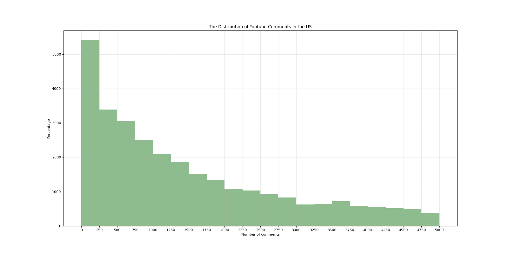
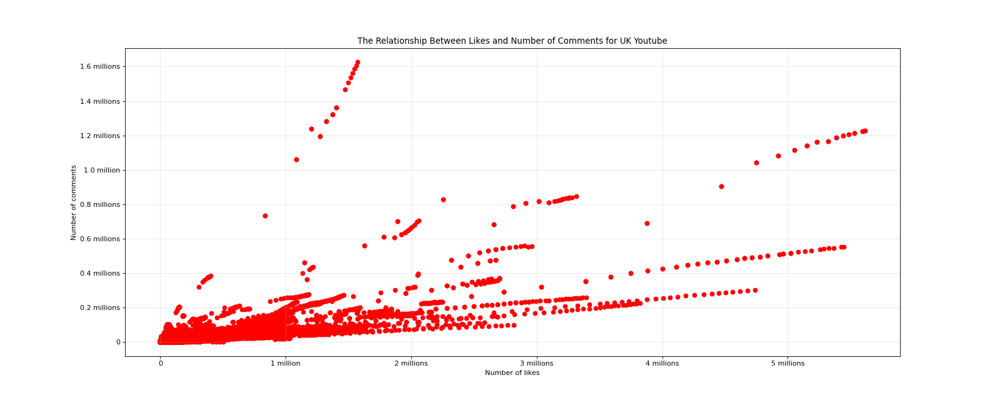

# Numpy - Practice

## Import Modules
```
import numpy as np
import matplotlib.pyplot as plt
import matplotlib
from matplotlib import font_manager 
import matplotlib.ticker as ticker
```

## Define Font for Chinese Charaters 
- For macOS
```
my_font = font_manager.FontProperties(size = 12, fname = "/System/Library/Fonts/Hiragino Sans GB.ttc")
```

## Data Source
```
Read in CSV file: 

us_file_path = "./data/us_videos.csv"

uk_file_path = "./data/gb_videos.csv"

us = np.loadtxt(us_file_path, delimiter = ",", dtype = "int", skiprows = 1)

uk = np.loadtxt(uk_file_path, delimiter = ",", dtype = "int", skiprows = 1)
```

## Case One
### Background
- 现在有关于英国和美国各自1000多个youtube视频的数据，包括点击、喜欢、不喜欢、评论数量等信息

### Question
- Display the distribution of US Youtube comments 

### Solution
- Number of comments is numerical --> use histogram 

```
Step 1: prepare data

# only take out the column "comment_count" --> the last column, -1 

us_comments = us[:, -1] 

# since there are only few extremes, we will neglect them (observed by graph the entire data) --> select "comment_count" < 50000

us_comments = us_comments[us_comments <= 5000] 
```
```
Step 2: plot figure

# Set the figure size
plt.figure(figsize = (20, 10), dpi = 80)

# Determine the bin width: print(us_comments.max(), us_comments.min())
bin_width = 250
bin_num = (us_comments.max() - us_comments.min())//bin_width

# Plot the graph 
plt.hist(us_comments, bin_num, color = "#8FBC8F")

# Fix x-axis 
plt.xticks(range(min(us_comments), max(us_comments) + bin_width, bin_width))

# Add figure descriptions
plt.xlabel("Number of comments")
plt.ylabel("Percentage")
plt.title("The Distribution of Youtube Comments in the US")
plt.grid(alpha = 0.3)

# Save figure and print figure
plt.savefig("./numpy/youtube_us")
plt.show()
```

- *也可以将bin_width设置成非固定 --> 通过传一个列表，而不是一个数字 --> 从而解决数据“前密后松”的问题* 




## Case Two
### Background
- 沿用case one的数据：英国和美国各自1000多个youtube视频的数据，包括点击、喜欢、不喜欢、评论数量等信息

### Question
- Display the relationship between "likes" and "comment_count" for UK Youtube

### Solution
- Looking for relationship between two variables --> use scatter plot
```
Step 1: Prepare data

# Only take out the "likes" and "comment_count" columns
uk_likes = uk[:, 1]
uk_comments = uk[:, 3]

Step 2: Plot graph

# Set the figure size
plt.figure(figsize = (20, 8), dpi = 80)

# Plot graph 
plt.scatter(uk_likes, uk_comments)
plt.ticklabel_format(style = "plain")

## Define a function to manage x-ticks
def x_millions_formatter(x, pos):
    if x == 0: 
        return "0"
    value = int(x/1000000) # based on observation, x (data values) are very large. It is approriate to keep it as integer
    if value == 1:
        return f'{value} million'
    else:
        return f'{value} millions'

## Define a function to manage y-ticks
def y_millions_formatter(y, pos):
    if y == 0: 
        return "0"
    value = float(y/1000000)
    if value == 1:
        return f'{value:.1f} million' # keep only one decimal
    else:
        return f'{value:.1f} millions'

## 区分模块是被导入还是直接运行

if __name__ == '__main__':

# Below are the local-only code

    # Modify xticks and yticks
    ax = plt.gca()
    ax.xaxis.set_major_formatter(ticker.FuncFormatter(x_millions_formatter))
    ax.yaxis.set_major_formatter(ticker.FuncFormatter(y_millions_formatter))

# Add figure descriptions
plt.xlabel("Number of likes")
plt.ylabel("Number of comments")
plt.title("The Relationship Between Likes and Number of Comments for UK Youtube")
plt.grid(alpha = 0.3)

# Save figure and print figure
plt.savefig('./numpy/youtube_uk.png')
plt.show()
```



- *拓展：suppose there are few outliers in "likes", and we want to neglect them (observed by graph the entire array)*
    1. *We will select "likes" < 500000*
    2. *Select from the original array, because "likes" and "comment_count" need to be paired*
    - *```uk = uk[uk[:, 1] <= 500000]```*