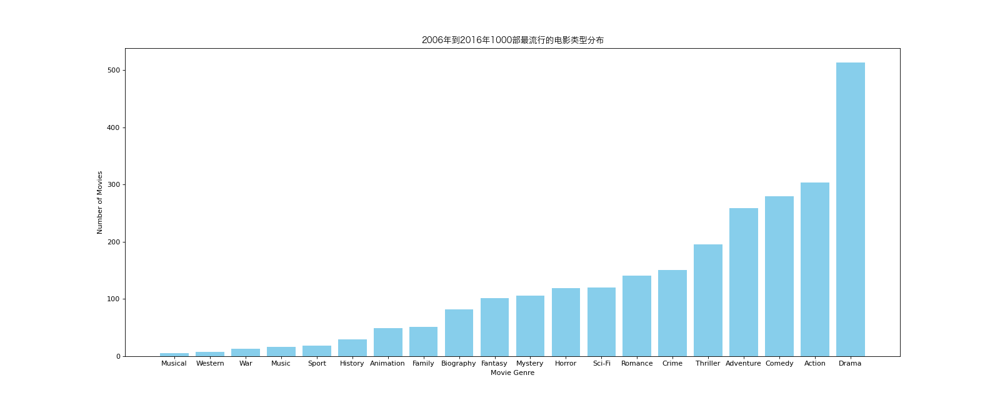

# Pandas - Count String

## Import Modules
```python
import pandas as pd
import numpy as np
import matplotlib.pyplot as plt
from matplotlib import font_manager 
```

## Define Font for Chinese Charaters 
- For macOS

```python
my_font = font_manager.FontProperties(size = 12, fname = "/System/Library/Fonts/Hiragino Sans GB.ttc")
```

## Data Source
```python
df = pd.read_csv("data/IMDB-Movie-Data.csv")

print(df["Genre"])
```


## Case: 统计电影分类情况
- 思路：  

```
Given: Genre  Movie_title
       "a, b"  XXXXX
       "b, f"  NNNNN
       "y z a" PPPPP
Manipulate to: [a, b, f, y, z]
                1  1  0  0  0
                0  1  1  0  0
                1  0  0  1  1  
```
### Solution
```python
# Step 1: 简历统计列表

temp_list = df["Genre"].str.split(",").tolist() # output: [[],[],[]]

genre_list = list(set(i for j in temp_list for i in j)) 
```

- 生成器表达式：                
1. 遍历 temp_list 中的每一个子列表 j，然后再遍历子列表 j 中的每一个元素 i，最终生成一个包含所有 i 的迭代器。                    
2. 将生成器表达式的结果转换为一个集合（set）。 集合的特性：会自动去重，因此结果中只包含唯一的元素               
3. 将集合转换回列表，得到一个包含所有唯一元素的列表 genre_list          

```python
# Step 2: 构造全部为0的dataframe: 行数等同于原始数据中的行数（电影的个数），列数等同于不重复的genre个数。column index：columns = genre_list

zero_df = pd.DataFrame(np.zeros((df.shape[0], len(genre_list))), columns = genre_list)
```
```python
# Step 3: 根据每个电影genre的信息，给zero_df赋值（=1）

for i in range(df.shape[0]):
    zero_df.loc[i,temp_list[i]] = 1 # 对应原始数据的每一行i；对应temp_list每行里出现的genre列 --> 然后赋值1

# 设置 pandas 打印选项，取消截断 --> 从而打印所有的列
pd.set_option("display.max_rows", None)
pd.set_option("display.max_columns", None)

print(zero_df.head(10))
```
```python
# Step 4: 统计每个genre的电影个数之和
count_movie = zero_df.sum(axis = 0) # axis - 0 --> 求的是column total
```
```python
# Step 5: 按照count多少排序
count_genre = count_movie.sort_values()
```
```python
# Step 6; 绘制genre的分布图
plt.figure(figsize = (20, 8), dpi = 80)

plt.bar(count_genre.index, count_genre.values, color = "#87CEEB")

plt.xticks(range(len(count_genre.index)), count_genre.index)
plt.xlabel("Movie Genre")
plt.ylabel("Number of Movies")
plt.title("2006年到2016年1000部最流行的电影类型分布", fontproperties = my_font)

plt.savefig("./pandas/genre.png")
plt.show()
```

