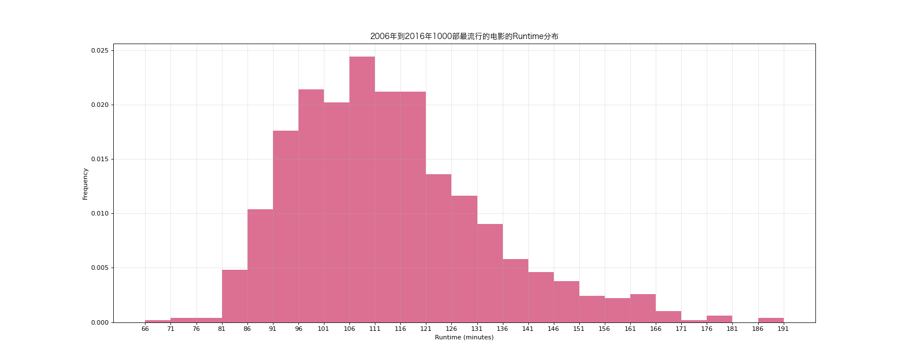
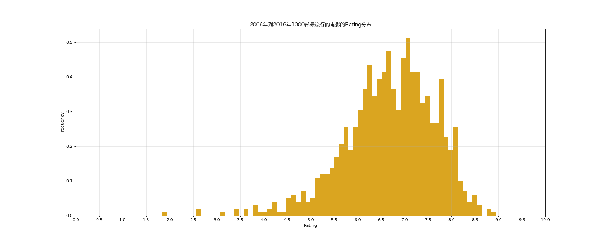
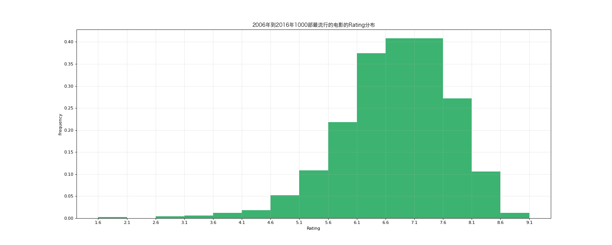

# Pandas - Practice One

## Import Modules
```python
import pandas as pd
import numpy as np
from matplotlib import pyplot as plt
from matplotlib import font_manager
```

## Define Font for Chinese Charaters 
- For macOS

```python
my_font = font_manager.FontProperties(size = 12, fname = "/System/Library/Fonts/Hiragino Sans GB.ttc")
```

## Data Source
```python
dfm = pd.read_csv("data/IMDB-Movie-Data.csv")

print(dfm.info())
print(dfm.head(10))
```

## Background
- 现有2006年到2016年1000部最流行的电影信息

## Case One
### Question
- 计算从2006年到2016年1000部最流行的电影的评分的平均数

### Solution 
```python
dfm["Rating"].mean()
```

## Case Two
### Question
- 计算从2006年到2016年1000部最流行的电影的导演人数 (并未查重)

### Solution 
```python
# Take out director name --> array with all the names 

dfm["Director"].tolist() 
```
```python
# Turning array to dictionary 

set(dfm["Director"].tolist())
```
```python
# Count numbers of director in the dictionary 

len(set(dfm["Director"].tolist()))

# An alternative way to count: 

dfm["Director"].unique() # automatically return a list 

len(dfm["Director"].unique())
```

## Case Three
### Question
- 计算从2006年到2016年1000部最流行的电影的演员人数 (并未查重)

### Solution 
```python
# a list of all actor names for each movie （大列表嵌套小列表）

temp_actor = dfm["Actors"].str.split(",").tolist()
```
```python
# 展开大列表&小列表到同一个列表中
actor_list = [i for j in temp_actor for i in j] 
```
```python
actor_num = len(set(actor_list))

print(actor_num)
```


## Case Four
### Question
- 展示rating和runtime的分布情况 --> using histogram

### Solution 
```python
# Step 1: prepare data

runtime = dfm["Runtime (Minutes)"].values # --> output is ndarray. Without .values, output is a series
```
```python
# Step 2: determine bin width

max_runtime = runtime.max()
min_runtime = runtime.min()
bin_width = 5 #通过多次跟grid比较调试得出
```
```python
# Step 3: determine number of bins

num_bin = (max_runtime - min_runtime)//bin_width
```
```python
# Step 4: plot data 

# set the figure size 
plt.figure(figsize = (20, 8), dpi = 80)

# plot graph 
plt.hist(runtime, num_bin, density = True, color = "#DB7093")

# modify x-ticks 
plt.xticks(range(min_runtime, max_runtime + bin_width, bin_width))

# add descriptions 
plt.xlabel("Runtime (minutes)")
plt.ylabel("Frequency")
plt.title("2006年到2016年1000部最流行的电影的Runtime分布", fontproperties = my_font)
plt.grid(alpha = 0.3)

# save and display figure
plt.savefig("./pandas/runtime.png")
plt.show()
```



## Case Five
### Question 
- 展示rating的分布情况 --> using histogram

### Solution 
```python
# Step 1: prepare data

rating = dfm["Rating"].values # --> output is ndarray. Without .values, output is a series
```
```python
# Step 2: determine bin width

max_rating = rating.max()
min_rating = rating.min()
print(max_rating, min_rating)
bin_width = 0.1 #通过多次跟grid比较调试得出
```
```python
# Step 3: determine number of bins

num_bin = (max_rating - min_rating)//bin_width
```
```python
# Step 4: plot data

# set the figure size 
plt.figure(figsize = (20, 8), dpi = 80)

# plot graph 
plt.hist(rating, int(num_bin), density = True, color = "#DAA520", align = "left")

# modify x-ticks 
plt.xticks(np.arange(0, 10 + bin_width, bin_width)[::5]) 

# Since is rating (data is between 1 and 10), so using number 0 and 10 instead of min_rating and max_rating for simplicity
# 不能使用range()因为range函数只接受整数参数

# add descriptions 
plt.xlabel("Rating")
plt.ylabel("Frequency")
plt.title("2006年到2016年1000部最流行的电影的Rating分布", fontproperties = my_font)
plt.grid(alpha = 0.3)

# save figure and display
plt.savefig("./pandas/rating.png")
plt.show()
```



## Case Six
### Question 
- 展示rating的分布情况 

### Solution
- A better way to display the histogram: aligning each bar with each x-tick

```python
# Step 1: prepare data

rating = dfm["Rating"].values # --> output is ndarray. Without .values, output is a series
```
```python
# Step 2: determine bin width

max_rating = rating.max()
min_rating = rating.min()
```
```python
# Step 3: determine number of bins

num_bin_list = [1.6]
i = 1.6
while i <= max_rating:
    i+= 0.5
    num_bin_list.append(i)
```
```python
# Step 4: plot data

plt.figure(figsize = (20, 8), dpi = 80)

# plot graph 
plt.hist(rating, num_bin_list, density = True, color = "#3CB371")

# modify x-ticks 
plt.xticks(num_bin_list) 

# add descriptions 
plt.xlabel("Rating")
plt.ylabel("Frequency")
plt.title("2006年到2016年1000部最流行的电影的Rating分布", fontproperties = my_font)
plt.grid(alpha = 0.3)

# save figure and display
plt.savefig("./pandas/better_rating.png")
plt.show()
```

