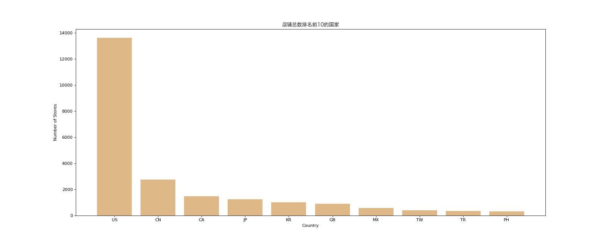
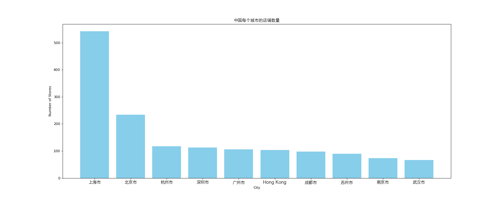

# Pandas - Practice Two

## Import Modules
```python
import pandas as pd
import numpy as np
from matplotlib import pyplot as plt
from matplotlib import font_manager
```

## Define Font for Chinese Charaters 
- For macOS

```python
my_font = font_manager.FontProperties(size = 12, fname = "/System/Library/Fonts/Hiragino Sans GB.ttc")
```

## Data Source
```python
df = pd.read_csv("data/starbucks.csv")

# 设置 pandas 打印选项，取消截断 --> 从而打印所有的列
pd.set_option("display.max_columns", None)

print(df.info)
print(df)
```
## Background 
- 现有关于全球星巴克的信息
  
## Case One
### Question
- 使用matplotlib呈现店铺总数排名前10的国家

### Solution 
- Categorial data, so using bar chat 

```python
# Step 1: prepare data
group_country = df.groupby(by = "Country").count()["Store Number"].sort_values(ascending = False)[:10]
```
```python
# Step 2: plot data 
        
# 1. set figure size
plt.figure(figsize = (20, 8), dpi = 80)

# 2. plot graph
x = group_country.index
y = group_country.values
plt.bar(range(len(x)), y, color = "#DEB887")

# 3. set the xticks 
plt.xticks(range(len(x)), x)

# 4. add descriptions 
plt.xlabel("Country")
plt.ylabel("Number of Stores")
plt.title("店铺总数排名前10的国家", fontproperties = my_font)

# 5. save and display the figure
plt.savefig("./pandas/stores.png")
plt.show()
```


## Case Two
### Question
- 使用matplotlib呈现出在中国店铺数量排名前十的城市

### Solution 
- Categorial data, so using bar chat 

```python
# Step 1: perpare data
china_store = df.groupby(by = ["Country" , "City"]).count()["Store Number"].sort_values(ascending = False)["CN"][:10]
```
```python
# Step 2: plot data

# set figure size
plt.figure(figsize = (20, 8), dpi = 80)

# plot bar chat
x = china_store.index
y = china_store.values
plt.bar(range(len(x)), y, color = "#87CEEB")

# modify xticks
plt.xticks(range(len(x)), x, fontproperties = my_font)

# add description 
plt.xlabel("City")
plt.ylabel("Number of Stores")
plt.title("中国每个城市的店铺数量", fontproperties = my_font)    

# save and display the figure
plt.savefig("./pandas/stores_china.png")
plt.show()
```

