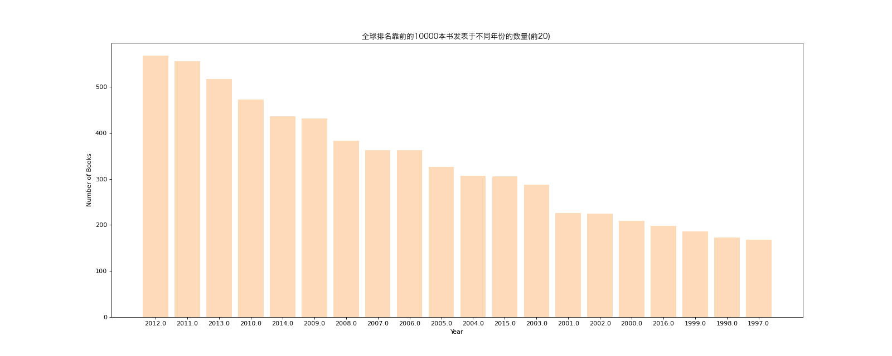
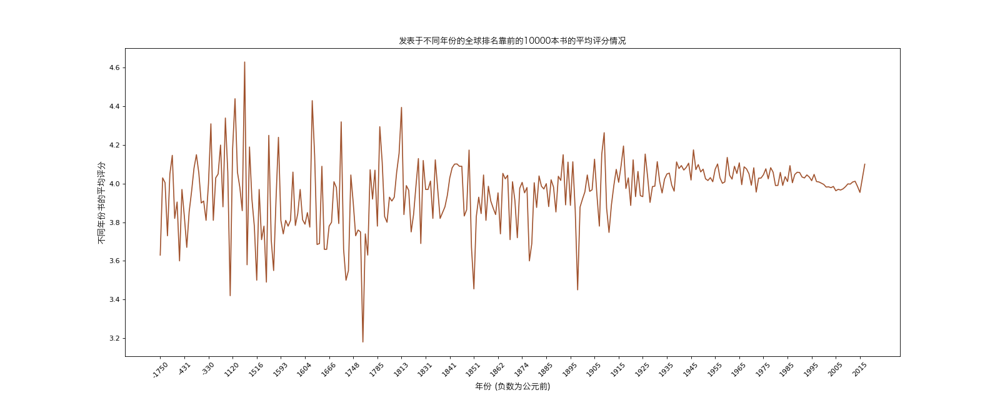

# Pandas - Practice Three

## Import Modules
```python
import pandas as pd
import numpy as np
from matplotlib import pyplot as plt
from matplotlib import font_manager
```

## Define Font for Chinese Charaters 
- For macOS

```python
my_font = font_manager.FontProperties(size = 12, fname = "/System/Library/Fonts/Hiragino Sans GB.ttc")
```

## Data Source
```python
df = pd.read_csv("data/books.csv")

# 设置 pandas 打印选项，取消截断 --> 从而打印所有的列
pd.set_option("display.max_columns", None)

print(df.info)
print(df)
```

## Background 
- 现有全球排名靠前的10000本书的数据
  
## Case One
### Question
- 请统计不同年份书的数量，并取前20个

### Solution 
- Categorial data, so using bar chat 

```python
# Step 1: prepare data

# there are NaN in "original_publication_year" --> drop them

df1 = df[pd.notnull(df["original_publication_year"])]

count_year = df1.groupby(by = "original_publication_year").count()["title"].sort_values(ascending = False).head(20)
```
```python
# Step 2: plot the data 
        
# 1. set figure size
plt.figure(figsize = (20, 8), dpi = 80)

# 2. plot graph
x = count_year.index
y = count_year.values
plt.bar(range(len(x)), y, color = "#FFDAB9")

# 3. set the xticks 
plt.xticks(range(len(x)), x)

# 4. add descriptions 
plt.xlabel("Year")
plt.ylabel("Number of Books")
plt.title("全球排名靠前的10000书中发表于不同年份的数量(前20) ", fontproperties = my_font)

# 5. save and display the figure
plt.savefig("./pandas/books_year.png")
plt.show()
```



## Case Two
### Question 
- 请统计不同年份书的平均评分情况

### Solution
- Categorial data, so using bar chat
 
```python
# Step 1: prepare data
        
# there are NaN in "original_publication_year" --> drop them

df1 = df[pd.notnull(df["original_publication_year"])]

mean_rating = df1["average_rating"].groupby(by = df["original_publication_year"]).mean()

# there are negative publication year --> 负数表示公元前
```
```python
# Step 2: plot the data 

# set figure size
plt.figure(figsize = (20, 8), dpi = 80)

# plot bar chat 
x = mean_rating.index
y = mean_rating.values
plt.plot(range(len(x)), y, color = "#A0522D")

# set the xticks 
plt.xticks(range(len(x))[::10], np.round(x[::10]).astype(int), rotation = 45)

# add descriptions 
plt.xlabel("年份 (负数为公元前)", fontproperties = my_font)
plt.ylabel("不同年份书的平均评分", fontproperties = my_font)
plt.title("发表于不同年份的全球排名靠前的10000本书的平均评分情况", fontproperties = my_font)

# save and display the figure
plt.savefig("./pandas/mean_rating.png")
plt.show()
```

