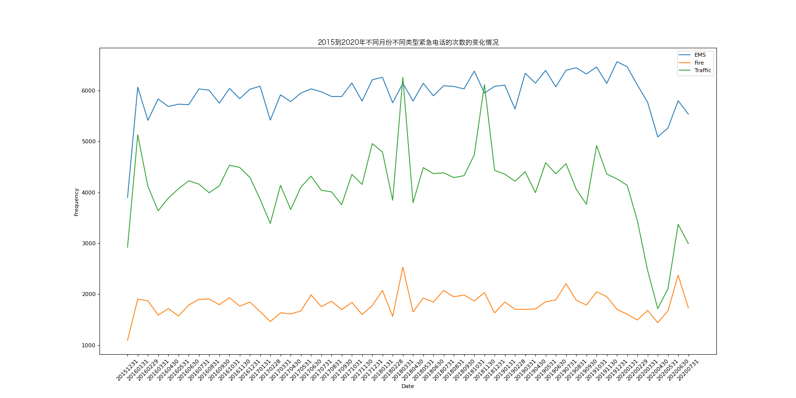

# Pandas - Time Series

## Import Modules
```python
import pandas as pd
import numpy as np
from matplotlib import pyplot as plt
from matplotlib import font_manager
```

## Define Font for Chinese Charaters 
- For macOS

```python
my_font = font_manager.FontProperties(size = 12, fname = "/System/Library/Fonts/Hiragino Sans GB.ttc")
```

## Data Source
```python
# read CSV data file 
df = pd.read_csv("/Users/jrq/Desktop/learnpy/data/911.csv")
# 设置 pandas 打印选项，取消截断 --> 从而打印所有的列
pd.set_option("display.max_columns", None)
print(df.head(), df.info())
```


## Time Series 知识点：
### 通式: 
```python
pd.data_range(start = None, end = None, periods = None, freq = "D")
```
### 参数：
```freq = "D"``` --> 以天为单位                     
```freq = "20D"``` --> 也以20天为单位                       
`freq = "M"` --> 以月为单位                     
`periods = 10` --> 生成10个                     
`"B"` --> business day                  
`"H"` --> hour                  
`"T"` or `"min" ` --> minute                    
`"S"` --> second                    
`"L"` or `"ms"`--> milli 毫秒               
`"U"` --> micro 微秒                        
`"M"` --> MonthEnd 每月最后一个日历日                       
`"BM"` --> BusinessMonthEnd 每月最后一个工作日                          
`"MS"`--> MonthBegin 每月第一个日历日                       
`"BMS"` --> BusinessMonthBegin 每月第一个工作日                         

### Examples：
`pd.date_range(start = "20171230", end = "20180131", freq = "D")`               
`pd.date_range(start = "2017/12/30", end = "20180131", freq = "D")`              
`pd.date_range(start = "2017-12-30", end = "20180131", freq = "D")`         
`pd.date_range(start = "2017-12-30 10:10:30", end = "20180131", freq = "D")`     
`pd.date_range(start = "20171230", end = "20180131", freq = "M")`           
`pd.date_range(start = "20171230", end = "20180131", freq = "3M")`          
`pd.date_range(start = "20171230", end = "20180131", freq = "H")`               
`pd.date_range(start = "20171230", end = "20180131", freq = "10D")`             
`pd.date_range(start = "20171230", end = "20180131", periods = 10, freq = "10D")`           

当数据中没有完整的时间序列（例如：原始数据里的事时间字符串）--> 用`pd.to_datetime()`来转换            
  
```python
df["timeStamp"] = pd.to_datetime(df["timeStamp"], format = "")
```

- `format = ""`通常可以不用写，但当`pd.to_datetime`无法识别格式时（例如时间字符串不完整，或包含中文），再用`format = ""`参数来强调应该怎么格式化
    - 例如：`format = "%Y-%m-%d %H:%M:%S %f"`


### 重采样
- 将时间序列从一个频率转化为另一个频率进行处理的过程
  - 例如：`df.resample("M")`
  - 例如：`df.resample("M").mean()` --> 按月来统计平均值
  - 例如：`df.resample("10D").count()` --> 按每十天的频率求个数

### 降采样
- 将高频率数据转化成低频率数据 （例如：从秒到天）

### 升采样
- 将低频率数据转化成高频率数据

 
## Case One
### Background 
- 现在我们有2015到2020年25万条911的紧急电话的数据

### Question One
- 请统计出这些数据中不同类型的紧急情况的次数

### Solution
```python
# print(df["title"].str.split(": "))

# Step 1: 遍历列表 - 提取category
    # if dataframe：use to_list（），if series: use tolist()
temp_list = df["title"].str.split(": ").tolist()
category_list = list(set(i[0] for i in temp_list))

print(category_list) # there are only three categories 
```
```python
# Step 2: 构造全为0的数组
zeros_df = pd.DataFrame(np.zeros((df.shape[0], len(category_list))), columns = category_list)
```
```python
# Step 3: 赋值
for cat in category_list:
    zeros_df[cat][df["title"].str.contains(cat)] = 1 
print(zeros_df)
# df["title"].str.contains(cat) --> change the title conlumn to bool (true or false)
# if ture, change 0 to 1 i zeros_df
```
```python
# Step 4: 统计出这些数据中不同类型的紧急情况的次数
sum_cat = zeros_df.sum(axis = 0)
print(sum_cat)
```

#### Alternative Way: 统计出这些数据中不同类型的紧急情况的次数
```python
category_list = [i[0] for i in temp_list]

# add a "cate" column to the original dataframe
df["cate"] = pd.DataFrame(np.array(category_list).reshape((df.shape[0], 1)))

print(df.head(5))

# 统计出这些数据中不同类型的紧急情况的次数
print(df.groupby(by = "cate").count()["title"])
```


### Question Two
- 如果我们还想统计出不同月份不同类型紧急电话的次数的变化情况，How?

### Solution 
```python
# Step 1: 降采样
df["timeStamp"] = pd.to_datetime(df["timeStamp"]) #将时间字符串转化成时间类型
df.set_index("timeStamp", inplace = True)  # set timeStamp as index

# Step 2: 对不同的cate分类进行绘图
plt.figure(figsize = (20, 10),dpi = 80)

for group_name, group_data in df.groupby(by = "cate"):
    count_month = group_data.resample("M").count()["title"]
    # Step 3: 绘制折线图
    x = count_month.index
        # change datetime format 
    _x = [i.strftime("%Y%m%d") for i in x]
    y = count_month.values
    plt.plot(range(len(_x)), y, label = group_name)

plt.xticks(range(len(_x)), _x, rotation = 45)
plt.xlabel("Date")
plt.ylabel("Frequency")
plt.legend(loc = "best")
plt.title("2015到2020年不同月份不同类型紧急电话的次数的变化情况", fontproperties = my_font)
plt.savefig("./pandas/911_by_month.png")
plt.show()
```
